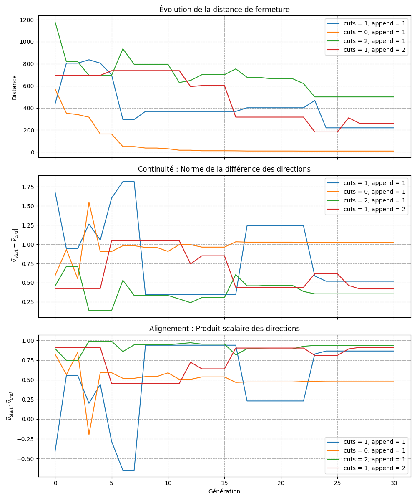
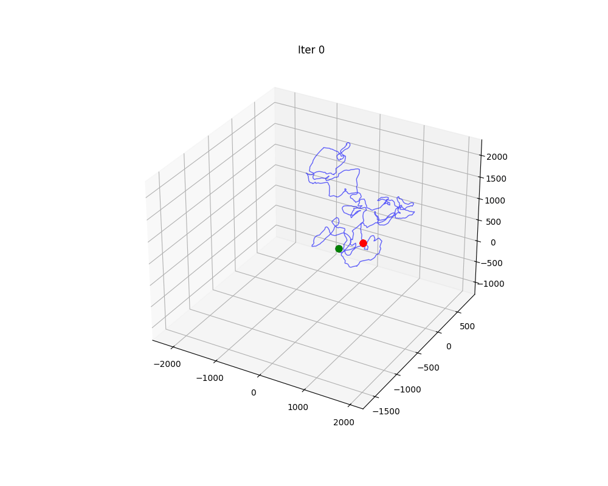

# Algorithmes génétique pour l'Optimisation de Tables de Rotation d'ADN
https://github.com/Mc-cloud/Algo-genetique

[](https://www.python.org/)
[](LICENSE)
[](tests/)


## Objectif

Ce projet utilise un algorithme génétique pour optimiser les paramètres de rotation (twist, wedge, direction) des dinucléotides afin de minimiser la distance de fermeture des structures ADN circulaires (plasmides). L'algorithme cherche à trouver une table de rotations qui permette à la séquence ADN de se refermer sur elle-même avec une erreur minimale.

## Principe 

L'ADN est représenté par une trajectoire 3D calculée à partir : 
- D'une **séquence de nucléotides** (A, T, G, C)
- D'une **table de rotations** définissant trois angles pour chaque dinucléotide:
    - Twist (rotation autour de l'axe)
    - Wedge (inclinaison)
    - Direction (orientation)

L'algorithme génétique optimise cette table pour que la structure 3D forme un cercle fermé

## Fonctionnalités

- **Encodage génétique** : Table de rotations comme ADN de l'individu
- **Multiples méthodes de sélection** : 
    - Elitiste
    - Tournoi
    - Roulette
    - Par rang
- **Opérateurs génétiques** : 
    - Croisement pondéré par le fitness
    - Mutations (petites fréquentes et des plus gross rares)
    - Elitisme
- **Fonction de fitness** : Test de fermeture à plusieurs points de coupure
- **Recuit simulé** : Température décroissante pour affiner la convergence
- **Visualisations** : Génération de graphiques et GIfs d'évolution
- **Benchmarks** : Comparaison systématique de configurations


## Structure du projet

```
Algo-genetique/
├── algo/                      # Cœur de l'algorithme génétique
│   ├── algogenetique.py      # Classe Individu et fonction AlgoGenetique
│   ├── fitness.py            # Calcul du score de fermeture
│   └── selection.py          # 7 méthodes de sélection différentes
├── dna/                       # Représentation de l'ADN
│   ├── RotTable.py           # Table de rotations des dinucléotides
│   └── Traj3D.py             # Calcul de trajectoire 3D
├── data/                      # Séquences ADN de test
│   ├── plasmid_2k_*.fasta    # Plasmides de 2000 paires de bases
│   ├── plasmid_8k.fasta      # Plasmide de 8000 paires de bases
│   └── plasmid_180k.fasta    # Grand plasmide
├── data_algo/                 # Résultats d'expériences sauvegardés
├── documents/                 # Documentation et rapports
│   └── Rapport_*.pdf         # Rapport détaillé du projet
├── gifs/                      # Visualisations animées
│   ├── benchmark_*.gif       # Résultats de benchmarks
│   └── etapes.gif            # Évolution d'une simulation
├── tests/                     # Tests unitaires
│   ├── test_algogenetique.py
│   ├── test_fitness.py
│   └── test_selection.py
├── main.py                    # Script principal
├── plot.py                    # Génération de graphiques
├── resultsmanager.py          # Gestion des résultats
├── simulsmanager.py           # Gestion des simulations
├── executeur_comparaison_algos.py  # Comparaison d'algorithmes
├── benchmark.py               # Recherche de paramètres optimaux
├── benchmark_cuts.py          # Benchmark sur les points de coupure
└── tests_param.py             # Tests paramétriques
```

## 🔧 Installation
### En utilisant pip :
```bash
git clone https://github.com/Mc-cloud/Algo-genetique.git
cd Algo-genetique

pip install -r requirements.txt
```
### Avec Conda

```bash
# Cloner le dépôt
git clone https://github.com/Mc-cloud/Algo-genetique.git
cd Algo-genetique

# Créer et activer l'environnement conda
conda env create -f environment.yaml
conda activate algo-genetique
```

## Utilisation :
Mettre l'explication pour execution...

## Visualisations : 
Le projet génère diverses visualisations pour analyser les dynamiques évolutives :
- **Evolution du Fitness** : Suivi du fitness de la population au fil du temps

- **Evolution d'un plasmide au fils des générations:**

## Tests :

Exécutez la suite de tests pour vérifier l'implémentation :

```bash
# Exécuter avec couverture
coverage run -m unittest discover -s tests -p "test_*.py"
coverage report
```
## Méthodes de sélection : 

Le projet implémente 7 méthodes de sélection :

| Méthode | Description | Usage |
|---------|-------------|-------|
| **elitiste** | Garde les N meilleurs individus | Convergence rapide, risque de convergence prématurée |
| **tournament** | Tournoi entre paires + 10% d'élite | Bon équilibre exploration/exploitation |
| **roulette** | Probabilité inversement proportionnelle au score | Maintient la diversité |
| **roulette_exp** | Roulette avec distribution exponentielle | Pression de sélection ajustable |
| **roulette_exp_norm** | Roulette exponentielle normalisée | Bon pour la convergence finale |
| **rang_reel** | Probabilité proportionnelle au rang | Évite la domination excessive |
| **rang_geo** | Distribution géométrique des probabilités | Bon compromis pression/diversité |

## Authors and acknowledgment
Merci à Melkior Demaille, Clément Cournil--Rabeux, Clément Rebola, et Mathéo Cahitte.

Cournil-Rabeux Clement

Demaille Melkior

Rebola Clement

<!-- ## License
For open source projects, say how it is licensed. -->

## Project status
<!-- If you have run out of energy or time for your project, put a note at the top of the README saying that development has slowed down or stopped completely. Someone may choose to fork your project or volunteer to step in as a maintainer or owner, allowing your project to keep going. You can also make an explicit request for maintainers. -->
Finished (we guess)

## testing the cover 
Pour tester le coverage, il faut se positionner dans la racine du projet : Algo-génétique.

coverage run -m unittest discover -s tests -p "test_*.py"
puis 

coverage report
